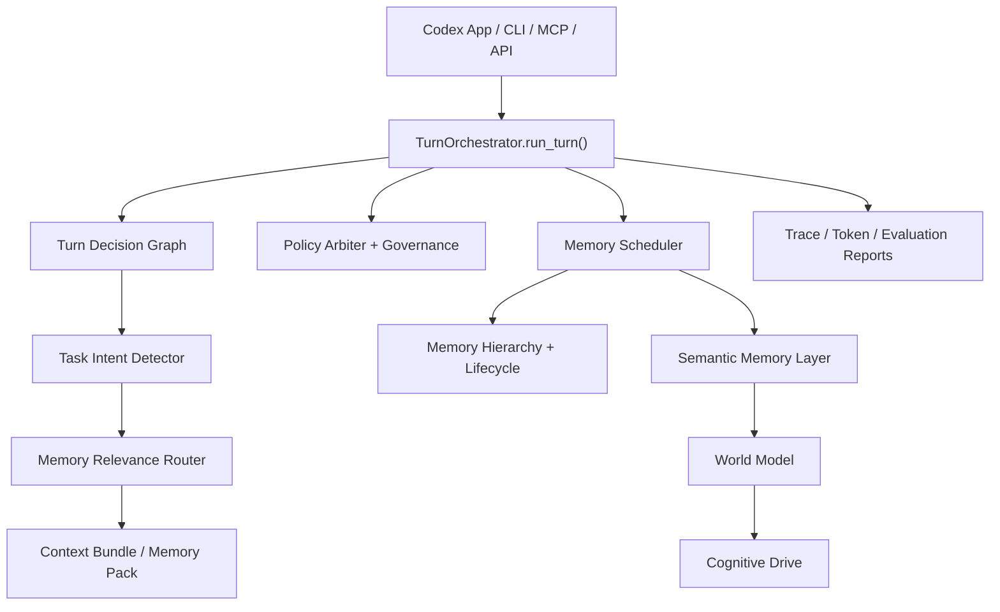

# hippocampus-memory

[中文](#中文) | [English](#english)

---

## 中文

`hippocampus-memory` 是一个本地优先的 AI 外部记忆运行时。当前定位是 **Codex-first Memory OS**：让 Codex App 在不同项目里自动使用独立记忆库，召回短小、可审计、对 coding 有帮助的上下文，并用评测证明记忆是否真的改善了 Codex 的表现。

它不是普通 RAG。项目的核心不是“搜出一堆文本”，而是给 coding agent 提供压缩后的工作上下文：Memory Pack、Project Profile、Code Map、Code Impact Pack、Context Bundle、执行 trace、策略报告和 benchmark 数据。

### 当前状态

项目已经进入可用的 v3 原型阶段：

- Codex App 全局 MCP 部署：Codex 打开哪个项目，就使用哪个项目自己的 `.hippo/hippo.db`。
- CLI / MCP / API 入口统一路由到 `TurnOrchestrator.run_turn()`。
- 任务感知召回：架构重构、bug 修复、调试、代码理解、通用问题会走不同的记忆重排策略。
- Memory OS 分层：Decision Graph、Policy Governance、Memory Scheduler、Semantic Layer、World Model、Cognitive Drive。
- 老项目冷启动：可检测已有代码项目，并在用户确认后使用 CodeGraph 摘要代码结构，注入为候选记忆。
- Codex 专用评测：包含 A/B coding task、memory-dependent task、long-document benchmark 和结构验证测试。
- Reasonix 专属 UI / shim 已移除，项目现在聚焦 Codex-first 的通用记忆运行时能力。

### 架构



### 设计原则

- 召回质量比记忆数量重要。
- 默认本地存储，不依赖云端服务。
- `private` / `sensitive` 记忆默认不召回。
- 不把完整聊天记录或大段源码塞进 prompt。
- CLI / MCP / API 对外接口保持兼容，内部逐步演进。
- CodeGraph、embedding、LLM 摘要等能力保持可选，失败时必须安全降级。

### 安装

在仓库根目录执行：

```powershell
python -m pip install -e .[quality,tokens]
```

如果使用仓库内虚拟环境：

```powershell
.\.venv\Scripts\Activate.ps1
python -m pip install -e .[quality,tokens]
```

### 部署到 Codex App

推荐使用全局 MCP 入口，让 Codex App 在每个项目中自动解析当前 workspace：

```powershell
hippo mcp-codex --fallback-root D:\codex\hippo_memory
```

在 `C:\Users\<you>\.codex\config.toml` 中配置：

```toml
[mcp_servers.hippo_memory]
command = 'D:\codex\hippo_memory\.venv\Scripts\python.exe'
args = ['-m', 'hippocampus_memory', 'mcp-codex', '--fallback-root', 'D:\codex\hippo_memory']
startup_timeout_sec = 120

[mcp_servers.hippo_memory.env]
PYTHONIOENCODING = 'utf-8'
PYTHONUTF8 = '1'
```

重启 Codex App 后：

- 在 `D:\project_a` 打开 Codex，会使用 `D:\project_a\.hippo\hippo.db`。
- 在 `D:\project_b` 打开 Codex，会使用 `D:\project_b\.hippo\hippo.db`。
- 新项目和老项目都会从部署之后开始积累聊天记忆。
- 老项目如果已有代码，可以走 CodeGraph bootstrap 先建立结构化代码记忆。

也可以为单个项目显式部署：

```powershell
hippo codex-deploy --root D:\your_project --project your_project
hippo doctor --root D:\your_project --json
```

### CodeGraph 冷启动记忆

当 hippo 识别到当前 workspace 是已有代码项目时，会返回 `codegraph_bootstrap.recommended=true`。

推荐流程：

1. Codex 先询问用户是否允许读取 CodeGraph 项目结构。
2. 用户确认后，Codex 调用 CodeGraph MCP 获取模块、符号、调用关系和架构摘要。
3. Codex 将压缩后的结构信息交给 hippo-memory。
4. hippo-memory 默认把这些信息放入 candidate queue，不直接写成长期事实。

这样可以让老项目不必从零开始积累记忆，同时避免把大量源码或不确定结论直接写入长期记忆。

### 常用命令

```powershell
hippo write --project demo --type decision --content "Decision: keep MCP routing thin."
hippo search "MCP routing" --project demo
hippo pack "Refactor scheduler boundaries" --project demo --compact
hippo auto-context "Fix failing scheduler policy test" --project demo --metadata
hippo auto-store --project demo --text "Decision: policy and scheduler communicate through reports."
hippo token-report "Refactor scheduler boundaries" --project demo
hippo token-ledger --project demo
hippo doctor --root D:\your_project --json
```

### MCP / Codex 使用方式

AGENTS.md 中推荐：

- 复杂 coding、debugging、architecture 任务开始时调用 `hippo_memory_context_auto`。
- 直接符号问题使用 `hippo_memory_code_symbols` 或 `hippo_memory_code_references`。
- 有意义的任务结束时调用 `hippo_memory_memory_auto_store`，只写入高置信、非敏感、可复用信息。
- 不要为了“记得更多”而写入低价值聊天片段。

### 评测与效果复盘

项目内置两类 benchmark：

1. `benchmarks/coding_tasks`：A/B coding task，覆盖纯算法、项目上下文任务、memory-dependent 任务。
2. `benchmarks/long_text_tasks`：长文任务，覆盖 needle、规则冲突、噪声抑制、压缩保真、隐私敏感内容。

先跑 smoke：

```powershell
.\.venv\Scripts\python.exe -m benchmarks.coding_tasks.harness --mode dry_run --timestamp SMOKE
.\.venv\Scripts\python.exe -m benchmarks.long_text_tasks.scripts.harness --mode local --timestamp SMOKE_LONG
```

用一段时间后跑 Codex A/B：

```powershell
.\.venv\Scripts\python.exe -m benchmarks.coding_tasks.harness --mode codex --timestamp AFTER_7_DAYS
.\.venv\Scripts\python.exe -m benchmarks.long_text_tasks.scripts.harness --mode codex --timestamp AFTER_7_DAYS_LONG
```

输出会生成在对应 benchmark 的 `runs/<timestamp>/` 下，包含 patch、pytest 日志、`scores.json` 和 `benchmark_report.md`。运行目录默认被 `.gitignore` 排除，不应提交到仓库。

建议观察四类指标：

- 正确性：B 组是否比 A 组更少误改、更少遗漏约束。
- 改动范围：B 组是否更接近最小可行修改。
- 回归风险：CLI / MCP / API 是否保持兼容。
- 长上下文能力：长文规则、隐藏约束、跨会话历史是否被正确召回。

### 测试

完整测试：

```powershell
.\.venv\Scripts\python.exe -m pytest tests -q --basetemp tmp\pytest-full -p no:cacheprovider
.\.venv\Scripts\ruff.exe check .
```

重点测试：

```powershell
.\.venv\Scripts\python.exe -m pytest tests/test_structural_validation.py -q
.\.venv\Scripts\python.exe -m pytest tests/test_task_aware_retrieval.py -q
.\.venv\Scripts\python.exe -m pytest tests/test_ab_memory_matrix.py -q
.\.venv\Scripts\python.exe -m pytest tests/test_codex_only_runtime.py -q
.\.venv\Scripts\python.exe -m pytest tests/test_codegraph_bootstrap.py -q
```

### 仓库结构

```text
hippocampus_memory/
  cli.py                         # CLI entrypoint
  mcp_server.py                  # MCP server
  context_bundle.py              # Context Bundle builder
  memory_policy.py               # Memory write / capture policy
  orchestrator/
    turn_orchestrator.py         # Runtime kernel
    task_intent.py               # Task intent detector
    memory_relevance_router.py   # Task-aware memory reranker
    memory_scheduler.py          # Lifecycle scheduler and OS layers
benchmarks/
  coding_tasks/                  # A/B coding benchmark definitions
  long_text_tasks/               # Long-document benchmark definitions
docs/
  PROJECT_REPORT.md
  CODEX_APP_MEMORY_DEPLOYMENT_AND_EVALUATION.md
tests/
  ...                            # Unit, integration, acceptance, benchmark tests
```

### 已知限制

- 这是本地优先的 Codex memory runtime，不是完整自治 agent。
- Token 节省是启发式估算，不等于真实账单。
- CodeGraph bootstrap 需要用户确认，且依赖可用的 CodeGraph MCP。
- 记忆召回能降低上下文缺失，但不能替代测试、代码审查和静态分析。
- 长期记忆如果写入低质量内容，会降低召回质量；需要持续使用评测和 candidate queue 控制质量。

---

## English

`hippocampus-memory` is a local-first external memory runtime for AI coding agents. The current direction is **Codex-first Memory OS**: Codex App can open any project, resolve that project's own memory database, inject compact auditable context, and evaluate whether memory actually improves coding performance.

This is not a generic RAG demo. The core outputs are coding-agent context artifacts: Memory Pack, Project Profile, Code Map, Code Impact Pack, Context Bundle, execution traces, policy reports, and benchmark data.

### Current Status

The project is a usable v3 prototype:

- Global Codex App MCP deployment with per-project `.hippo/hippo.db` resolution.
- CLI / MCP / API flows are routed through `TurnOrchestrator.run_turn()`.
- Task-aware retrieval for architecture refactors, bug fixes, debugging, code understanding, and general queries.
- Memory OS layers: Decision Graph, Policy Governance, Memory Scheduler, Semantic Layer, World Model, and Cognitive Drive.
- Cold-start support for existing projects through optional CodeGraph bootstrap.
- Codex-focused evaluation: A/B coding tasks, memory-dependent tasks, long-document benchmarks, and structural validation tests.
- Reasonix-specific UI patches and shims have been removed; the project now focuses on Codex-first runtime memory.

### Architecture


### Design Rules

- Recall quality matters more than memory volume.
- Memory is local-first by default.
- Sensitive and private memories are not recalled by default.
- The system should not inject full chat history or large source-code dumps.
- CLI / MCP / API compatibility must be preserved while internals evolve.
- CodeGraph, embeddings, and LLM summarization remain optional and must degrade safely.

### Installation

From the repository root:

```powershell
python -m pip install -e .[quality,tokens]
```

With the repository virtual environment:

```powershell
.\.venv\Scripts\Activate.ps1
python -m pip install -e .[quality,tokens]
```

### Deploy For Codex App

Use one global MCP entry so Codex App can resolve the active workspace automatically:

```powershell
hippo mcp-codex --fallback-root D:\codex\hippo_memory
```

Add this to `C:\Users\<you>\.codex\config.toml`:

```toml
[mcp_servers.hippo_memory]
command = 'D:\codex\hippo_memory\.venv\Scripts\python.exe'
args = ['-m', 'hippocampus_memory', 'mcp-codex', '--fallback-root', 'D:\codex\hippo_memory']
startup_timeout_sec = 120

[mcp_servers.hippo_memory.env]
PYTHONIOENCODING = 'utf-8'
PYTHONUTF8 = '1'
```

After restarting Codex App:

- Opening Codex in `D:\project_a` uses `D:\project_a\.hippo\hippo.db`.
- Opening Codex in `D:\project_b` uses `D:\project_b\.hippo\hippo.db`.
- New and existing projects start accumulating memory from the point of deployment.
- Existing code projects can optionally use CodeGraph bootstrap to seed structural code memory.

Project-local deployment is also available:

```powershell
hippo codex-deploy --root D:\your_project --project your_project
hippo doctor --root D:\your_project --json
```

### CodeGraph Bootstrap

When hippo detects that the current workspace is an existing code project, it can return `codegraph_bootstrap.recommended=true`.

Recommended flow:

1. Codex asks the user for permission to inspect CodeGraph project structure.
2. After approval, Codex queries the CodeGraph MCP for modules, symbols, call relationships, and architecture summaries.
3. Codex sends a compressed structure summary to hippo-memory.
4. hippo-memory queues the result as a candidate memory by default instead of writing uncertain facts directly into long-term memory.

This helps old projects avoid a cold start without storing large source-code dumps or unverified conclusions.

### Common Commands

```powershell
hippo write --project demo --type decision --content "Decision: keep MCP routing thin."
hippo search "MCP routing" --project demo
hippo pack "Refactor scheduler boundaries" --project demo --compact
hippo auto-context "Fix failing scheduler policy test" --project demo --metadata
hippo auto-store --project demo --text "Decision: policy and scheduler communicate through reports."
hippo token-report "Refactor scheduler boundaries" --project demo
hippo token-ledger --project demo
hippo doctor --root D:\your_project --json
```

### MCP / Codex Usage

Recommended AGENTS.md behavior:

- At the start of non-trivial coding, debugging, or architecture work, call `hippo_memory_context_auto`.
- For direct symbol questions, use `hippo_memory_code_symbols` or `hippo_memory_code_references`.
- Near the end of meaningful work, call `hippo_memory_memory_auto_store` with concise high-confidence, non-sensitive information.
- Do not write low-value chat fragments merely to increase memory volume.

### Evaluation

The repository includes two benchmark groups:

1. `benchmarks/coding_tasks`: A/B coding tasks covering pure algorithms, project-context tasks, and memory-dependent tasks.
2. `benchmarks/long_text_tasks`: long-document tasks covering needles, rule conflicts, noise suppression, compression fidelity, and privacy-sensitive content.

Smoke runs:

```powershell
.\.venv\Scripts\python.exe -m benchmarks.coding_tasks.harness --mode dry_run --timestamp SMOKE
.\.venv\Scripts\python.exe -m benchmarks.long_text_tasks.scripts.harness --mode local --timestamp SMOKE_LONG
```

After using the system for a while, run Codex A/B benchmarks:

```powershell
.\.venv\Scripts\python.exe -m benchmarks.coding_tasks.harness --mode codex --timestamp AFTER_7_DAYS
.\.venv\Scripts\python.exe -m benchmarks.long_text_tasks.scripts.harness --mode codex --timestamp AFTER_7_DAYS_LONG
```

Each run writes artifacts under `runs/<timestamp>/`, including patches, pytest logs, `scores.json`, and `benchmark_report.md`. Run outputs are ignored by git and should not be committed.

Useful review dimensions:

- Correctness: does memory reduce missed constraints and wrong edits?
- Change scope: does memory keep edits smaller and more targeted?
- Regression risk: do CLI / MCP / API contracts stay compatible?
- Long-context behavior: are hidden rules, cross-session decisions, and old constraints recalled correctly?

### Tests

Full verification:

```powershell
.\.venv\Scripts\python.exe -m pytest tests -q --basetemp tmp\pytest-full -p no:cacheprovider
.\.venv\Scripts\ruff.exe check .
```

Focused suites:

```powershell
.\.venv\Scripts\python.exe -m pytest tests/test_structural_validation.py -q
.\.venv\Scripts\python.exe -m pytest tests/test_task_aware_retrieval.py -q
.\.venv\Scripts\python.exe -m pytest tests/test_ab_memory_matrix.py -q
.\.venv\Scripts\python.exe -m pytest tests/test_codex_only_runtime.py -q
.\.venv\Scripts\python.exe -m pytest tests/test_codegraph_bootstrap.py -q
```

### Repository Layout

```text
hippocampus_memory/
  cli.py                         # CLI entrypoint
  mcp_server.py                  # MCP server
  context_bundle.py              # Context Bundle builder
  memory_policy.py               # Memory write / capture policy
  orchestrator/
    turn_orchestrator.py         # Runtime kernel
    task_intent.py               # Task intent detector
    memory_relevance_router.py   # Task-aware memory reranker
    memory_scheduler.py          # Lifecycle scheduler and OS layers
benchmarks/
  coding_tasks/                  # A/B coding benchmark definitions
  long_text_tasks/               # Long-document benchmark definitions
docs/
  PROJECT_REPORT.md
  CODEX_APP_MEMORY_DEPLOYMENT_AND_EVALUATION.md
tests/
  ...                            # Unit, integration, acceptance, benchmark tests
```

### Known Limitations

- This is a Codex memory runtime, not a complete autonomous agent.
- Token savings are heuristic estimates, not billing measurements.
- CodeGraph bootstrap requires user approval and an available CodeGraph MCP.
- Memory recall reduces context loss but does not replace tests, review, or static analysis.
- Low-quality long-term memories can hurt retrieval quality; use benchmarks and candidate queues to keep memory clean.
