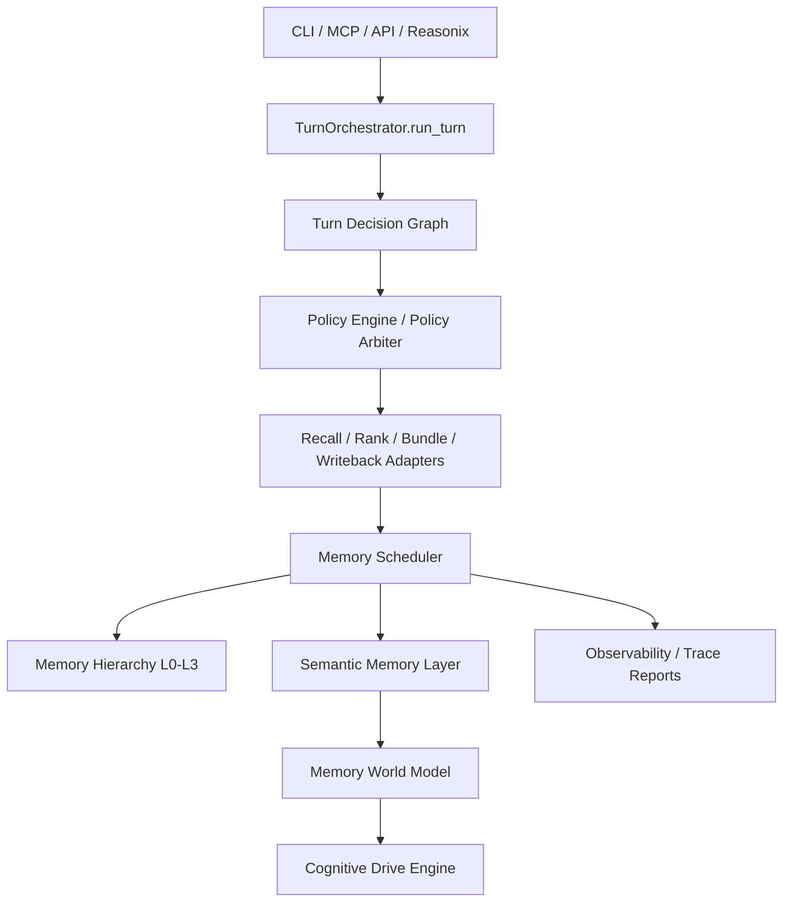

# hippocampus-memory

`hippocampus-memory` is a local-first Memory OS runtime for AI coding agents.

It is not a normal RAG project. The goal is not to dump large chat logs into a vector database and search them later. The goal is to give tools such as Reasonix, Codex, Claude Code, DeepSeek, and local agents a short, relevant, auditable working context for long-running software projects.

The project started as an external memory and Reasonix context compression tool. It has now evolved into a staged Memory Runtime OS: CLI, MCP, and API memory execution paths enter `TurnOrchestrator.run_turn()`, then pass through decision, policy, scheduler, semantic, world-model, and cognitive-drive layers.

## Status

The project is runnable and test-covered, but the OS-level runtime architecture is still experimental.

Stable and usable today:

- Local SQLite memory store
- Project-local memory isolation
- Memory Pack
- Project Profile
- Code Map
- Code Impact Pack
- Context Bundle
- Automatic recall
- Automatic memory admission and candidate queue
- CLI, lightweight MCP, and HTTP API entrypoints
- Reasonix deployment helper, global shim, and status bar integration
- Token savings estimation and per-session ledger
- Turn Orchestrator routing for CLI/MCP/API memory flows

Implemented runtime architecture layers:

- Turn Orchestrator
- Turn Decision Graph
- Adaptive Policy Engine
- Policy Governance and drift guardrails
- Multi-policy arbitration
- Memory Scheduler
- L0/L1/L2/L3 Memory Hierarchy
- Semantic Memory Model
- Memory World Model
- Cognitive Drive Engine

Important boundary: the high-level OS, semantic, world-model, and cognitive-drive layers currently generate deterministic plans, reports, traces, and scheduler decisions. They do not silently mutate the memory database or launch uncontrolled background reasoning. This is intentional.

## Why This Exists

AI coding agents still have practical memory problems:

1. They forget project decisions, constraints, and failure history when the conversation gets long.
2. Putting everything into the prompt wastes tokens and often hurts attention.
3. Manual copy-paste context workflows do not scale across real projects.

`hippocampus-memory` keeps durable project memory outside the model context, then injects only the compact context needed for the current task.

The design target is closer to an agent memory runtime than a chatbot memory plugin.

## Architecture



Runtime flow:

1. A CLI command, MCP tool call, API request, or Reasonix session starts a memory operation.
2. `TurnOrchestrator.run_turn()` becomes the single memory runtime entrypoint.
3. The decision graph decides whether to recall memory, use cache, inject context, skip memory, or fallback.
4. Policy layers arbitrate recall, compression, latency, safety, and cost preferences.
5. Existing core modules still perform retrieval, ranking, packing, context building, and memory admission.
6. Scheduler, semantic, world-model, and cognitive-drive layers generate lifecycle plans, consistency reports, semantic fusion, reasoning propagation, and self-driven task proposals.
7. The caller receives injected context plus structured trace data.

Core memory modules are intentionally preserved:

- `recall_policy.py`
- `context_bundle.py`
- `memory_policy.py`
- `ranker.py`
- `consolidator.py`

The Memory OS layers wrap and coordinate these modules instead of replacing them.

## Core Concepts

### Memory Pack

A compact task-focused memory packet. It prioritizes decisions, constraints, failures, task state, and verified facts. Private and sensitive memories are excluded by default.

### Project Profile

A project-level summary with project purpose, current state, indexed files, recent memories, risks, unknowns, and implementation notes.

### Code Map

A compact map generated from indexed project files. Python symbol/import/call extraction uses the standard library AST first. Other languages currently use fallback heuristics.

### Code Impact Pack

A change-planning context pack. It helps an agent reason about likely affected files, risks, invariants, and useful tests before editing code.

### Context Bundle

The main context artifact injected into Reasonix or other AI coding tools. It can combine Project Profile, Memory Pack, Code Impact Pack, and Code Map within a bounded token budget.

### Turn Orchestrator

The unified runtime entrypoint for memory operations. CLI, MCP, and API flows route through this layer so trace, selected memories, injected context, and writeback behavior stay consistent.

### Memory Scheduler

A cross-turn lifecycle planning layer for decay, promotion, compression, eviction, hierarchy assignment, policy alignment, semantic consistency, and optimization reports.

### Memory World Model

A semantic graph that maps memories into entities, concepts, decisions, events, and patterns. It supports semantic fusion, contradiction detection, reasoning propagation, and global cognitive state reporting.

### Cognitive Drive Engine

A deterministic self-drive layer. It can generate internal goals from memory state, allocate attention to conflicts and uncertainty, select memory-driven tasks, and propose self-triggering reasoning or consolidation loops.

It does not autonomously rewrite long-term memory without explicit runtime integration.

## Installation

Requirements:

- Windows PowerShell for the provided Reasonix installer
- Python 3.11+
- Reasonix installed and available as `reasonix` on `PATH` if you want Reasonix integration

Install and deploy for Reasonix:

```powershell
git clone https://github.com/1362909994-create/hippo_memory.git
cd hippo_memory
.\install-reasonix-hippo.ps1 -ProjectRoot D:\your_project -ProjectName your_project
reasonix code D:\your_project
```

If Python 3.11+ is missing, the installer can try winget:

```powershell
.\install-reasonix-hippo.ps1 -InstallPythonWithWinget
```

Developer install:

```powershell
git clone https://github.com/1362909994-create/hippo_memory.git
cd hippo_memory
python -m pip install -e ".[quality,tokens]"
```

Optional extras:

```powershell
python -m pip install -e ".[semantic,chroma,lsp,quality,tokens]"
```

The default path does not require Chroma, sentence-transformers, or an online LLM.

## Reasonix Deployment

The one-command installer does the following:

- Installs `hippocampus-memory`
- Creates project-local `.hippo/hippo.db` and `.hippo.toml`
- Indexes project files, summaries, symbols, imports, and calls
- Adds `hippo_memory=hippo mcp-project` to Reasonix MCP config
- Installs a global Reasonix shim
- Generates a Context Bundle before `reasonix code ...`
- Injects that bundle through Reasonix startup arguments
- Patches the Reasonix status bar to show estimated Hippo token savings

Deployment check:

```powershell
hippo doctor --root D:\your_project
hippo doctor --root D:\your_project --json
```

Uninstall Reasonix integration:

```powershell
.\uninstall-reasonix-hippo.ps1 -ProjectRoot D:\your_project -RemoveProjectData -UninstallPackage
```

Remove project prompt blocks as well:

```powershell
.\uninstall-reasonix-hippo.ps1 -ProjectRoot D:\your_project -RemoveProjectMemory
```

## Common Commands

```powershell
hippo project-init my-project
hippo index-project D:\your_project --project my-project
hippo write --project my-project --type decision --content "Use SQLite as the default local store."
hippo search "previous decision about storage" --project my-project
hippo explain <memory_id> --project my-project --query "previous decision about storage"
hippo pack "continue the storage task" --project my-project
hippo project-profile --project my-project
hippo impact "change retrieval ranking" --project my-project
hippo auto-context "fix retrieval ranking bug" --project my-project --metadata
hippo auto-store --project my-project --text "Decision: rank exact project facts above generic source chunks."
hippo token-report "continue current task" --project my-project
hippo token-ledger --project my-project
hippo doctor --root D:\your_project --json
```

Run the HTTP API:

```powershell
hippo serve --host 127.0.0.1 --port 8765
```

Run the lightweight JSON-RPC stdio MCP server:

```powershell
hippo mcp
hippo mcp-project
```

## API and MCP Routing

Memory-related CLI, MCP, and API entrypoints now route through `TurnOrchestrator.run_turn()`.

Every turn can produce:

- `injected_context`
- `execution_trace`
- `retrieved_memories`
- `selected_memories`
- `context_budget`
- scheduler, semantic, world-model, and cognitive-drive reports

This keeps behavior consistent across CLI, MCP, and HTTP API without rewriting the existing retrieval and packing modules.

## Token Savings

Token savings are estimates, not provider billing values.

Approximate formula:

```text
saved_tokens = baseline_tokens - injected_context_tokens
```

This means the compressed Context Bundle is shorter than a naive full-context approach. It does not mean DeepSeek, Reasonix, OpenAI, Anthropic, or any other provider charged exactly that many fewer tokens.

Why it cannot be exact today:

- Hippo does not intercept the final provider request body.
- A true counterfactual prompt without Hippo is not available.
- Different providers tokenize text differently.
- Reasonix status bar integration is a UI patch, not a billing meter.

Use the status bar number as a compression signal, not an invoice.

## Data and Privacy

- Default storage is local SQLite.
- Memories are project-scoped by default.
- Private and sensitive memories are not recalled by default.
- Sensitive content should go through explicit user-controlled flows.
- Project indexing stores paths, hashes, summaries, symbols, imports, calls, and chunks; it should not be treated as a full source-code backup.
- Chroma, sentence-transformers, and LLM summarizers are optional capabilities.

## Testing

Current verification commands:

```powershell
.\.venv\Scripts\python.exe -m pytest -q
.\.venv\Scripts\ruff.exe check .
```

Latest verified result:

```text
170 passed
All checks passed
```

Test coverage includes:

- SQLite schema, CRUD, soft delete, hard delete
- Memory writer and retriever behavior
- Ranking, filtering, and deduplication
- Memory Pack and Context Bundle generation
- Project indexing and Python AST extraction
- Project Profile, Code Map, Code Impact Pack
- Automatic recall and automatic store policy
- Candidate queue and conflict handling
- Token report and token ledger
- Reasonix deploy, shim, status patch, and uninstall helpers
- Turn Orchestrator
- Decision Policy Engine
- Entrypoint routing through orchestrator
- Memory Scheduler
- Semantic model, world model, and cognitive drive layer

Known test gaps:

- Real Reasonix UI end-to-end automation
- Fresh Windows install matrix
- Long-session multi-project Reasonix resume testing
- Large-scale memory benchmark
- Real provider billing comparison
- Full MCP SDK compatibility testing

## What This Is Not

This project is not:

- A general-purpose vector database UI
- A hosted memory SaaS
- A replacement for source control
- A precise token billing system
- A fully autonomous agent that rewrites its memory without supervision
- A complete language server or exact whole-program call graph

It is a local memory runtime for AI coding workflows.

## Comparison With Related Systems

Compared with generic RAG:

- Hippo focuses on compact working context, not large-document Q&A.
- It prioritizes project memory, decisions, failures, constraints, and code impact.
- It treats memory admission, compression, decay, conflict, and traceability as first-class concerns.

Compared with hosted memory systems such as Mem0, Zep, or Letta-style agent memory:

- Hippo is local-first and coding-workflow-specific.
- Its core artifact is the Context Bundle / Memory Pack rather than a chat memory response.
- Its current strongest integration target is Reasonix and local AI coding CLIs.
- It is less mature as a hosted product and has fewer production integrations.

## Roadmap

Highest priority:

- Real Reasonix UI E2E tests
- Stronger memory admission gate
- Better benchmark datasets for recall quality
- Safer token savings presentation
- Full MCP SDK adapter while preserving current tool semantics
- Better documentation for scheduler, world model, and cognitive drive reports

Medium priority:

- More robust code graph and impact analysis
- Better cross-project isolation and migration tools
- Policy explainability UI or report command
- Larger performance benchmark across many memories and large repos

Lower priority or likely to cut:

- Heavy standalone browser UI
- Early productization for every non-Reasonix CLI
- Complex background daemons before core memory quality is proven
- Integrations that require intercepting provider secrets or final request bodies

## Development Principles

- Do not turn the project into ordinary RAG.
- Do not recall private or sensitive memories by default.
- Do not write uncertain memories directly into long-term memory.
- Keep Memory Pack and Context Bundle short, stable, and auditable.
- Preserve backward compatibility for CLI, MCP, API, and database migrations.
- Keep optional heavy dependencies optional.
- Prefer reversible orchestration layers over blind rewrites of core memory logic.

## License

No license file is currently included. Add one before publishing this as a reusable public package.
