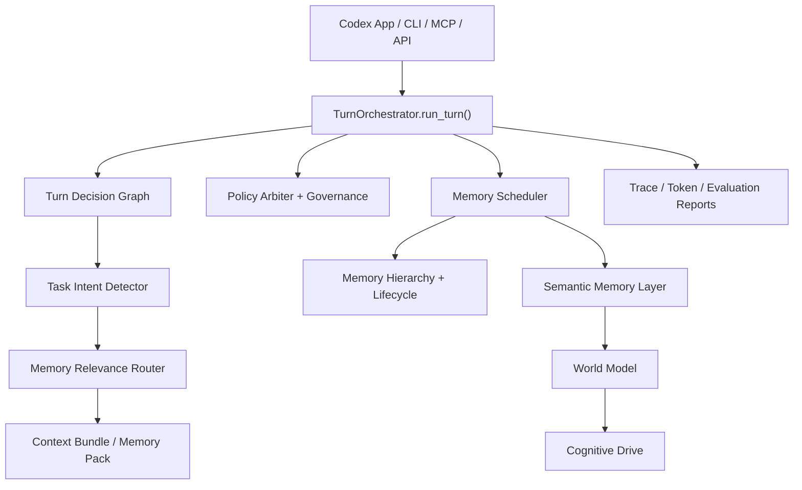

# hippocampus-memory

[??](#??) | [English](#english)

---

## ??

`hippocampus-memory` ???????? AI ????????????? **Codex-first Memory OS**?? Codex App ???????????????????????????????????????????? coding ???

????? RAG??????????????????????? coding agent ???????Memory Pack?Project Profile?Code Map?Code Impact Pack?Context Bundle??? trace???????????

### ????

????????? v3 ?????

- Codex App ?? MCP ?????? Codex App ???????????????? `.hippo/hippo.db`?
- CLI / MCP / API ??????? `TurnOrchestrator.run_turn()`?
- ??????????bug ???????????????????????????
- Memory OS ???Decision Graph?Policy Governance?Memory Scheduler?Semantic Layer?World Model?Cognitive Drive?
- ?????????????????????????? CodeGraph ???????????????
- Codex ??????? A/B coding task?memory-dependent task?long-document benchmark ????????
- Reasonix ?? UI / shim ??????????? Codex-first ???????????

### ??



?????

- ????????????
- ?????????????????
- ?? / private ????????
- ??????????????? prompt?
- CLI / MCP / API ????????????????
- CodeGraph?embedding?LLM ????????????????????

### ??

?????????

```powershell
python -m pip install -e .[quality,tokens]
```

????????????

```powershell
.\.venv\Scripts\Activate.ps1
python -m pip install -e .[quality,tokens]
```

### ??? Codex App

?????? MCP ???? Codex App ???????????? workspace?

```powershell
hippo mcp-codex --fallback-root D:\codex\hippo_memory
```

? `C:\Users\<you>\.codex\config.toml` ????

```toml
[mcp_servers.hippo_memory]
command = 'D:\codex\hippo_memory\.venv\Scripts\python.exe'
args = ['-m', 'hippocampus_memory', 'mcp-codex', '--fallback-root', 'D:\codex\hippo_memory']
startup_timeout_sec = 120

[mcp_servers.hippo_memory.env]
PYTHONIOENCODING = 'utf-8'
PYTHONUTF8 = '1'
```

?? Codex App ??

- ? `D:\project_a` ?? Codex???? `D:\project_a\.hippo\hippo.db`?
- ? `D:\project_b` ?? Codex???? `D:\project_b\.hippo\hippo.db`?
- ???????????????????????
- ????????????? CodeGraph bootstrap ???????????

?????????????

```powershell
hippo codex-deploy --root D:\your_project --project your_project
hippo doctor --root D:\your_project --json
```

### CodeGraph ?????

? hippo ????? workspace ???????????? `codegraph_bootstrap.recommended=true`???????

1. Codex ??????????? CodeGraph ?????
2. ??????Codex ?? CodeGraph MCP ??????????????????
3. Codex ??????????? hippo-memory?
4. hippo-memory ????????? candidate queue????????????????

???????????????????????????????????????????

### ????

```powershell
hippo write --project demo --type decision --content "Decision: keep MCP routing thin."
hippo search "MCP routing" --project demo
hippo pack "Refactor scheduler boundaries" --project demo --compact
hippo auto-context "Fix failing scheduler policy test" --project demo --metadata
hippo auto-store --project demo --text "Decision: policy and scheduler communicate through reports."
hippo token-report "Refactor scheduler boundaries" --project demo
hippo token-ledger --project demo
hippo doctor --root D:\your_project --json
```

### MCP / Codex ????

AGENTS.md ????????

- ?? coding?debugging?architecture ??????? `hippo_memory_context_auto`?
- ???????? `hippo_memory_code_symbols` ? `hippo_memory_code_references`?
- ??????????? `hippo_memory_memory_auto_store`??????????????????
- ?????????????????????

### ???????

?????? benchmark?

1. `benchmarks/coding_tasks`?A/B coding task???????????????memory-dependent ???
2. `benchmarks/long_text_tasks`???????? needle???????????????????????

?? smoke?

```powershell
.\.venv\Scripts\python.exe -m benchmarks.coding_tasks.harness --mode dry_run --timestamp SMOKE
.\.venv\Scripts\python.exe -m benchmarks.long_text_tasks.scripts.harness --mode local --timestamp SMOKE_LONG
```

??????? Codex A/B?

```powershell
.\.venv\Scripts\python.exe -m benchmarks.coding_tasks.harness --mode codex --timestamp AFTER_7_DAYS
.\.venv\Scripts\python.exe -m benchmarks.long_text_tasks.scripts.harness --mode codex --timestamp AFTER_7_DAYS_LONG
```

???????? benchmark ? `runs/<timestamp>/` ???? patch?pytest ???`scores.json` ? `benchmark_report.md`???????? `.gitignore` ???????????

?????????

- ????B ???? A ?????????????
- ?????B ?????????????
- ?????CLI / MCP / API ???????
- ??????????????????????????????

### ??

?????

```powershell
.\.venv\Scripts\python.exe -m pytest tests -q --basetemp tmp\pytest-full -p no:cacheprovider
.\.venv\Scripts\ruff.exe check .
```

?????

```powershell
.\.venv\Scripts\python.exe -m pytest tests/test_structural_validation.py -q
.\.venv\Scripts\python.exe -m pytest tests/test_task_aware_retrieval.py -q
.\.venv\Scripts\python.exe -m pytest tests/test_ab_memory_matrix.py -q
.\.venv\Scripts\python.exe -m pytest tests/test_codex_only_runtime.py -q
.\.venv\Scripts\python.exe -m pytest tests/test_codegraph_bootstrap.py -q
```

### ????

```text
hippocampus_memory/
  cli.py                         # CLI entrypoint
  mcp_server.py                  # MCP server
  context_bundle.py              # Context Bundle builder
  memory_policy.py               # Memory write / capture policy
  orchestrator/
    turn_orchestrator.py         # Runtime kernel
    task_intent.py               # Task intent detector
    memory_relevance_router.py   # Task-aware memory reranker
    memory_scheduler.py          # Lifecycle scheduler and OS layers
benchmarks/
  coding_tasks/                  # A/B coding benchmark definitions
  long_text_tasks/               # Long-document benchmark definitions
docs/
  PROJECT_REPORT.md
  CODEX_APP_MEMORY_DEPLOYMENT_AND_EVALUATION.md
tests/
  ...                            # Unit, integration, acceptance, benchmark tests
```

### ????

- ??????? Codex memory runtime??????? agent?
- Token ?????????????????
- CodeGraph bootstrap ????????????? CodeGraph MCP?
- ???????????????????????????????
- ??????????????????????????????? candidate queue ?????

---

## English

`hippocampus-memory` is a local-first external memory runtime for AI coding agents. The current direction is **Codex-first Memory OS**: Codex App can open any project, resolve that project's own memory database, inject compact auditable context, and evaluate whether memory actually improves coding performance.

This is not a generic RAG demo. The core outputs are coding-agent context artifacts: Memory Pack, Project Profile, Code Map, Code Impact Pack, Context Bundle, execution traces, policy reports, and benchmark data.

### Current Status

The project is a usable v3 prototype:

- Global Codex App MCP deployment with per-project `.hippo/hippo.db` resolution.
- CLI / MCP / API flows are routed through `TurnOrchestrator.run_turn()`.
- Task-aware retrieval for architecture refactors, bug fixes, debugging, code understanding, and general queries.
- Memory OS layers: Decision Graph, Policy Governance, Memory Scheduler, Semantic Layer, World Model, and Cognitive Drive.
- Cold-start support for existing projects through optional CodeGraph bootstrap.
- Codex-focused evaluation: A/B coding tasks, memory-dependent tasks, long-document benchmarks, and structural validation tests.
- Reasonix-specific UI patches and shims have been removed; the project now focuses on Codex-first runtime memory.

### Architecture


Design rules:

- Recall quality matters more than memory volume.
- Memory is local-first by default.
- Sensitive and private memories are not recalled by default.
- The system should not inject full chat history or large source-code dumps.
- CLI / MCP / API compatibility must be preserved while internals evolve.
- CodeGraph, embeddings, and LLM summarization remain optional and must degrade safely.

### Installation

From the repository root:

```powershell
python -m pip install -e .[quality,tokens]
```

With the repository virtual environment:

```powershell
.\.venv\Scripts\Activate.ps1
python -m pip install -e .[quality,tokens]
```

### Deploy For Codex App

Use one global MCP entry so Codex App can resolve the active workspace automatically:

```powershell
hippo mcp-codex --fallback-root D:\codex\hippo_memory
```

Add this to `C:\Users\<you>\.codex\config.toml`:

```toml
[mcp_servers.hippo_memory]
command = 'D:\codex\hippo_memory\.venv\Scripts\python.exe'
args = ['-m', 'hippocampus_memory', 'mcp-codex', '--fallback-root', 'D:\codex\hippo_memory']
startup_timeout_sec = 120

[mcp_servers.hippo_memory.env]
PYTHONIOENCODING = 'utf-8'
PYTHONUTF8 = '1'
```

After restarting Codex App:

- Opening Codex in `D:\project_a` uses `D:\project_a\.hippo\hippo.db`.
- Opening Codex in `D:\project_b` uses `D:\project_b\.hippo\hippo.db`.
- New and existing projects start accumulating memory from the point of deployment.
- Existing code projects can optionally use CodeGraph bootstrap to seed structural code memory.

Project-local deployment is also available:

```powershell
hippo codex-deploy --root D:\your_project --project your_project
hippo doctor --root D:\your_project --json
```

### CodeGraph Bootstrap

When hippo detects that the current workspace is an existing code project, it can return `codegraph_bootstrap.recommended=true`.

Recommended flow:

1. Codex asks the user for permission to inspect CodeGraph project structure.
2. After approval, Codex queries the CodeGraph MCP for modules, symbols, call relationships, and architecture summaries.
3. Codex sends a compressed structure summary to hippo-memory.
4. hippo-memory queues the result as a candidate memory by default instead of writing uncertain facts directly into long-term memory.

This helps old projects avoid a cold start without storing large source-code dumps or unverified conclusions.

### Common Commands

```powershell
hippo write --project demo --type decision --content "Decision: keep MCP routing thin."
hippo search "MCP routing" --project demo
hippo pack "Refactor scheduler boundaries" --project demo --compact
hippo auto-context "Fix failing scheduler policy test" --project demo --metadata
hippo auto-store --project demo --text "Decision: policy and scheduler communicate through reports."
hippo token-report "Refactor scheduler boundaries" --project demo
hippo token-ledger --project demo
hippo doctor --root D:\your_project --json
```

### MCP / Codex Usage

Recommended AGENTS.md behavior:

- At the start of non-trivial coding, debugging, or architecture work, call `hippo_memory_context_auto`.
- For direct symbol questions, use `hippo_memory_code_symbols` or `hippo_memory_code_references`.
- Near the end of meaningful work, call `hippo_memory_memory_auto_store` with concise high-confidence, non-sensitive information.
- Do not write low-value chat fragments merely to increase memory volume.

### Evaluation

The repository includes two benchmark groups:

1. `benchmarks/coding_tasks`: A/B coding tasks covering pure algorithms, project-context tasks, and memory-dependent tasks.
2. `benchmarks/long_text_tasks`: long-document tasks covering needles, rule conflicts, noise suppression, compression fidelity, and privacy-sensitive content.

Smoke runs:

```powershell
.\.venv\Scripts\python.exe -m benchmarks.coding_tasks.harness --mode dry_run --timestamp SMOKE
.\.venv\Scripts\python.exe -m benchmarks.long_text_tasks.scripts.harness --mode local --timestamp SMOKE_LONG
```

After using the system for a while, run Codex A/B benchmarks:

```powershell
.\.venv\Scripts\python.exe -m benchmarks.coding_tasks.harness --mode codex --timestamp AFTER_7_DAYS
.\.venv\Scripts\python.exe -m benchmarks.long_text_tasks.scripts.harness --mode codex --timestamp AFTER_7_DAYS_LONG
```

Each run writes artifacts under `runs/<timestamp>/`, including patches, pytest logs, `scores.json`, and `benchmark_report.md`. Run outputs are ignored by git and should not be committed.

Useful review dimensions:

- Correctness: does memory reduce missed constraints and wrong edits?
- Change scope: does memory keep edits smaller and more targeted?
- Regression risk: do CLI / MCP / API contracts stay compatible?
- Long-context behavior: are hidden rules, cross-session decisions, and old constraints recalled correctly?

### Tests

Full verification:

```powershell
.\.venv\Scripts\python.exe -m pytest tests -q --basetemp tmp\pytest-full -p no:cacheprovider
.\.venv\Scripts\ruff.exe check .
```

Focused suites:

```powershell
.\.venv\Scripts\python.exe -m pytest tests/test_structural_validation.py -q
.\.venv\Scripts\python.exe -m pytest tests/test_task_aware_retrieval.py -q
.\.venv\Scripts\python.exe -m pytest tests/test_ab_memory_matrix.py -q
.\.venv\Scripts\python.exe -m pytest tests/test_codex_only_runtime.py -q
.\.venv\Scripts\python.exe -m pytest tests/test_codegraph_bootstrap.py -q
```

### Repository Layout

```text
hippocampus_memory/
  cli.py                         # CLI entrypoint
  mcp_server.py                  # MCP server
  context_bundle.py              # Context Bundle builder
  memory_policy.py               # Memory write / capture policy
  orchestrator/
    turn_orchestrator.py         # Runtime kernel
    task_intent.py               # Task intent detector
    memory_relevance_router.py   # Task-aware memory reranker
    memory_scheduler.py          # Lifecycle scheduler and OS layers
benchmarks/
  coding_tasks/                  # A/B coding benchmark definitions
  long_text_tasks/               # Long-document benchmark definitions
docs/
  PROJECT_REPORT.md
  CODEX_APP_MEMORY_DEPLOYMENT_AND_EVALUATION.md
tests/
  ...                            # Unit, integration, acceptance, benchmark tests
```

### Known Limitations

- This is a Codex memory runtime, not a complete autonomous agent.
- Token savings are heuristic estimates, not billing measurements.
- CodeGraph bootstrap requires user approval and an available CodeGraph MCP.
- Memory recall reduces context loss but does not replace tests, review, or static analysis.
- Low-quality long-term memories can hurt retrieval quality; use benchmarks and candidate queues to keep memory clean.
